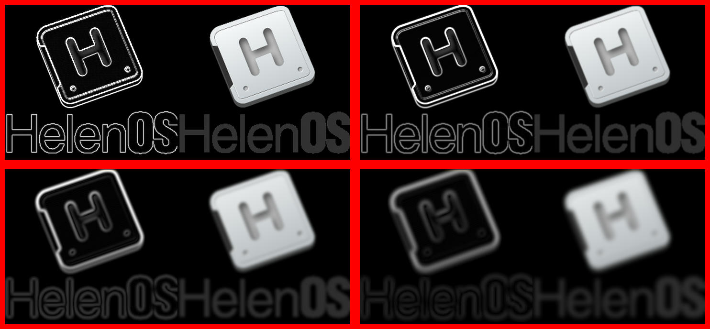

# Automatic HelenOS+Rust builder

_If you already have HelenOS toolchain installed locally and don't mind installing Rust on your machine, you will get a better experience (most importantly much shorter build time) building everything locally. See the guide in [rustc docs](https://github.com/mvolfik/rust/blob/helenos/src/doc/rustc/src/platform-support/helenos.md#building)._

Generate a customized Dockerfile with:  
`gen.py <arch> <application> [<application2> ...] > Dockerfile`  
Available architectures: i686, x86_64, powerpc, sparc64, aarch64. Each application should be a URL of a git repository.

Then, to build the HelenOS ISO image with the Rust programs included, run:  
`docker build --output=. .`  
This will create a directory `helenos-iso` with the ISO image inside.

To only build the applications, so that you can include them in your own HelenOS build, run:  
`docker build --output=. --target=apps .`

Interesting programs known to work on HelenOS:
- https://github.com/linebender/resvg: SVG rendering library and CLI tool
- https://github.com/mvolfik/imagecli-rs: CLI tool for image operations.
    - This is a fork of https://github.com/theotherphil/imagecli with updated dependencies to add HelenOS support to some crates.
- https://github.com/mvolfik/helenos-imageviewer-rs: Image viewer for HelenOS. **Does not work on i686.**
- https://github.com/chksum-rs/cli: CLI tool for calculating checksums of files as well as full directories.


## Full example of x86_64 build and run

```bash
python3 gen.py x86_64 https://github.com/linebender/resvg https://github.com/mvolfik/imagecli-rs https://github.com/mvolfik/helenos-imageviewer-rs > Dockerfile
docker build --output=. --target=helenos-iso .
qemu-system-x86_64 -enable-kvm -device e1000,netdev=n1 -netdev user,id=n1,hostfwd=udp::8080-:8080,hostfwd=udp::8081-:8081,hostfwd=tcp::8080-:8080,hostfwd=tcp::8081-:8081,hostfwd=tcp::2223-:2223 -usb -device nec-usb-xhci,id=xhci -device usb-tablet -device intel-hda -device hda-duplex -serial stdio -boot d -cdrom helenos-iso/image.iso
```

Example commands to run in HelenOS to test the applications linked above:

```
resvg /HelenOS.svg /tmp/a.png
imagecli -i /tmp/a.png -o data/web/demo.jpg -p 'scale 1.4 > DUP 3 > [id, gaussian 1.0, gaussian 3.0, gaussian 5.0] > MAP (DUP > sobel > hcat 2 > pad 10 10 10 10 (255,0,0)) > grid 2 2'
imageviewer-rs data/web/demo.jpg
```

Also, you can run `websrv` and open `http://localhost:8080/demo.jpg` on the host computer to view the processed image.

This is the image you should get:

.
